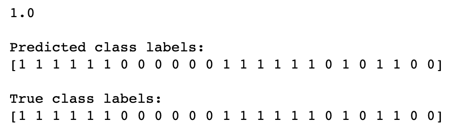

# Plagiarism Project, Machine Learning Deployment

## Table of Contents

1. [Project Overview](#project_overview)
2. [Installation](#installation)
3. [File Descriptions](#files)
4. [Results](#results)
5. [Licensing, Authors, and Acknowledgements](#licensing)

## Project Overview 

In this project, a plagiarism detector is deployed using Amazon SageMaker and PyTorch using the [Corpus of Plagiarised Short Answers](https://ir.shef.ac.uk/cloughie/resources/plagiarism_corpus.html) by Paul Clough and Mark Stevenson at the University of Sheffield. The plagiarism detector examines a text file and performs binary classification; labeling that file as either *plagiarized* or *not*, depending on how similar that text file is to a provided source text.

## Installation 

1. Python versions 3.6
2. Library and packages: pytorch 1.5, sagemaker, boto3, os, glob, numpy, pandas, matplotlib, seaborn, sklearn, pickle

## File Descriptions 

### Folders: 
**data:** contains the original data [Corpus of Plagiarised Short Answers](https://ir.shef.ac.uk/cloughie/resources/plagiarism_corpus.html)
**notebook_ims:** contains the images used in the notebooks
**plagiarism_data:** contains the preprocessed and cleaned data with selected engineered features
**source_pytorch:** contains the model and train functions when using a pytroch model
**source_sklearn:** contains the train fuctions when using a sklearn model

### Files:
**Notebook 1: Data Exploration**
* Load in the corpus of plagiarism text data.
* Explore the existing data features and the data distribution.

**Notebook 2: Feature Engineering**
* Clean and pre-process the text data.
* Define features for comparing the similarity of an answer text and a source text, and extract similarity features.
* Select "good" features, by analyzing the correlations between different features.
* Create train/test `.csv` files that hold the relevant features and class labels for train/test data points.

**Notebook 3: Train and Deploy Your Model in SageMaker**
* Upload train/test feature data to S3.
* Define a binary classification model and a training script.
* Train the model and deploy it using SageMaker.
* Evaluate the deployed classifier.

**helpers.py: functions used in the notebooks**

**problem_unittests.py: unit tests for the notebooks**

## Results

For this project, actually a sklearn model is sufficient enough to get a good accuracy score since the datasetis small with only 100 text files. The four models I tried: SVC, GaussianNB, LinearSVC, and DecisionTreeClassifier results in accuracy score as 0.96, 0.92, 1, and 0.96, which are all larger than 90%.

I also implemented a simple PyTorch neural network model to practice my model deployment skills. The model has with two hidden layers with dimensions 16 and 5, and after each layer I set a 20% dropout to prevent overfitting. The accuracy score on the test data is 1. The results is gievn below:

## Licensing, Authors, and Acknowledgements

Acknowledge to [Udacity](https://www.udacity.com/) and to Paul Clough and Mark Stevenson for the data [Corpus of Plagiarised Short Answers](https://ir.shef.ac.uk/cloughie/resources/plagiarism_corpus.html).  

